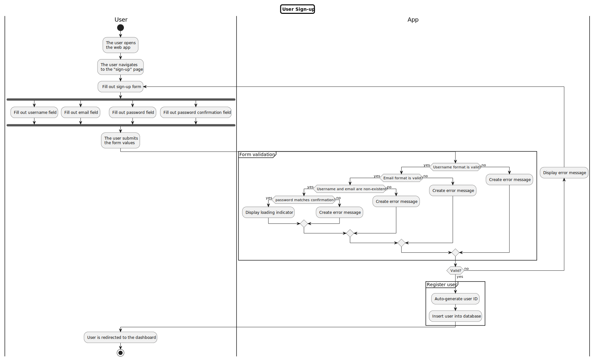
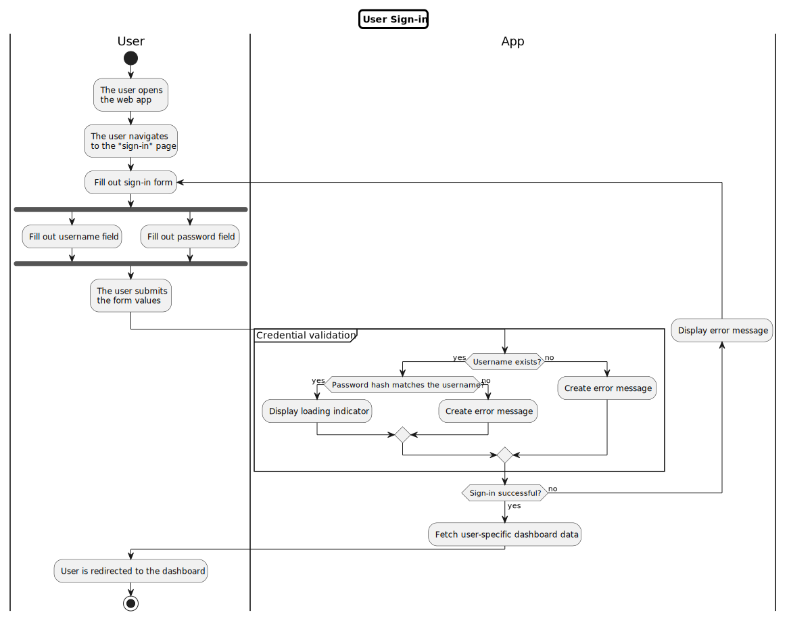
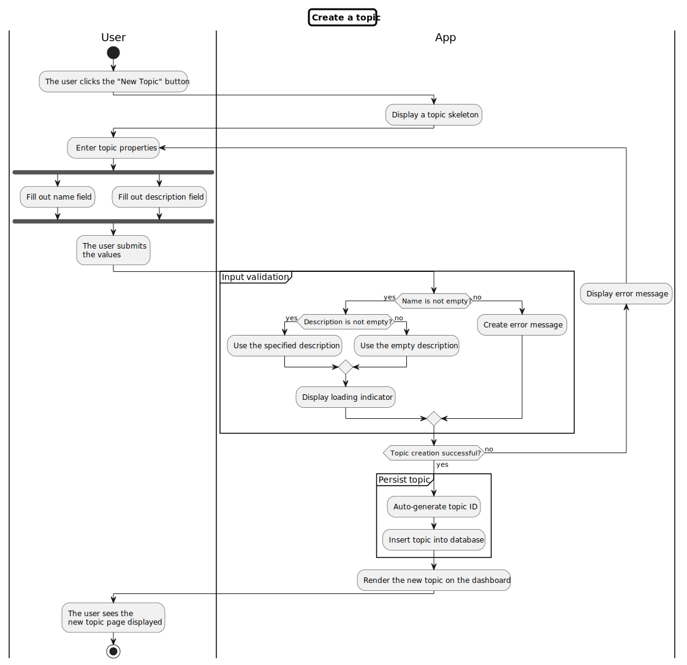
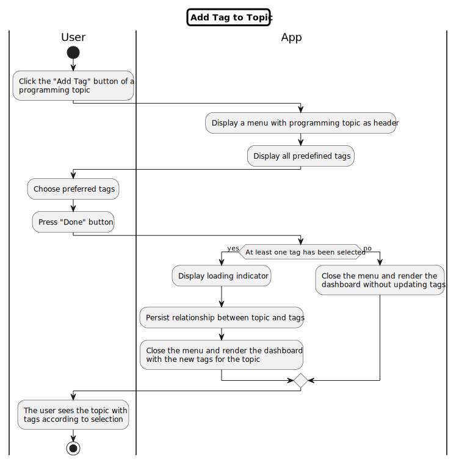
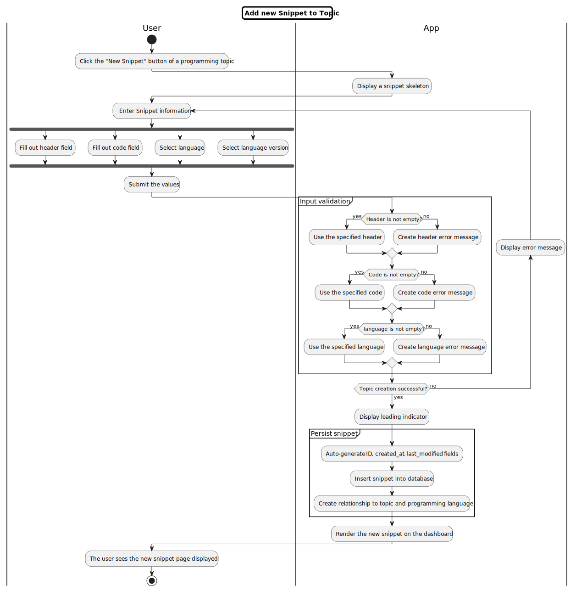

# SnipMan - Milestone 1

## Entity-Relationship Diagram

## Activity Diagrams

### Use-Case 1: User sign-up

### Use-Case 2: User sign-in

### Use-Case 3: Create topic

### Use-Case 4: Add a tag to a topic

### Use-Case 5: Add a new snippet to a topic

