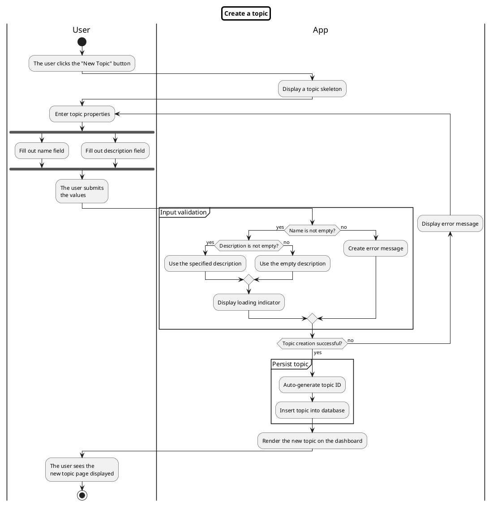

```puml
@startuml
skinparam titleBorderRoundCorner 10
skinparam titleBorderThickness 3
skinparam titleBorderColor black
title Create a topic

|User|
start
:The user clicks the "New Topic" button;
|App|
:Display a topic skeleton;
|User|
repeat: Enter topic properties;
fork
  :Fill out name field;
fork again
  :Fill out description field;
end fork
:The user submits 
the values;
|App|
partition "Input validation" {
    if (Name is not empty?) then (yes)
        if (Description is not empty?) then (yes)
            :Use the specified description;
        else (no)
            :Use the empty description;
        endif
        :Display loading indicator;
    else (no)
        :Create error message;
    endif
}
backward :Display error message;
repeat while (Topic creation successful?) is (no) not (yes)
partition "Persist topic" {
    :Auto-generate topic ID;
    :Insert topic into database;
}
:Render the new topic on the dashboard;
|User|
:The user sees the 
new topic page displayed;
stop
@enduml
```