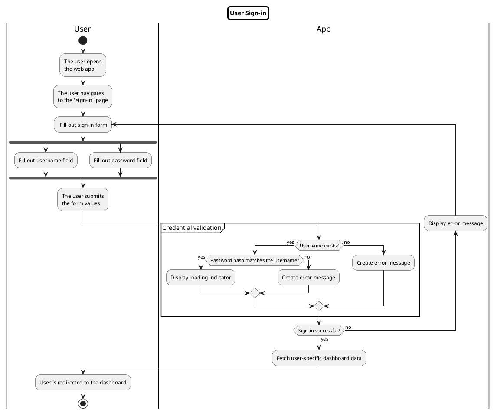

```puml
@startuml
skinparam titleBorderRoundCorner 10
skinparam titleBorderThickness 3
skinparam titleBorderColor black
title User Sign-in

|User|
start
:The user opens
the web app;
:The user navigates
to the "sign-in" page;
repeat: Fill out sign-in form;
fork
  :Fill out username field;
fork again
  :Fill out password field;
end fork
:The user submits 
the form values;
|App|
partition "Credential validation" {
    if (Username exists?) then (yes)
        if (Password hash matches the username?) then (yes)
            :Display loading indicator;
        else (no)
            :Create error message;
        endif
    else (no)
        :Create error message;
    endif
}
backward :Display error message;
repeat while (Sign-in successful?) is (no) not (yes)
:Fetch user-specific dashboard data;
|User|
:User is redirected to the dashboard;
stop
@enduml
```