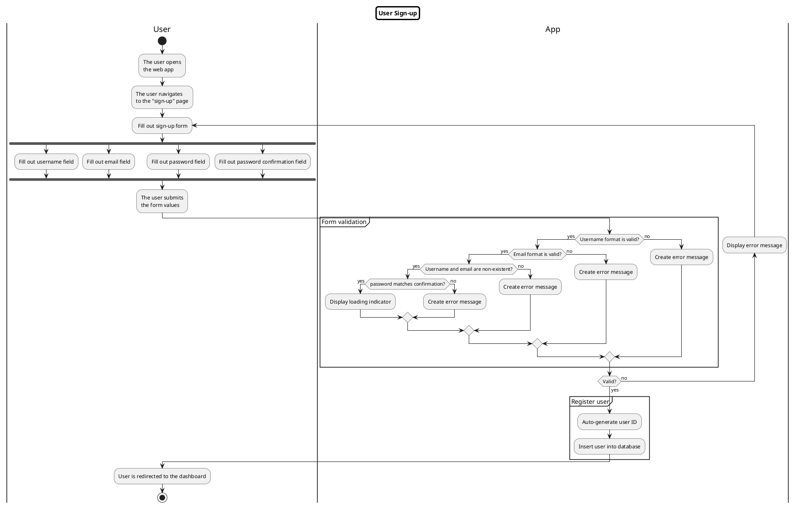

```puml
@startuml
skinparam titleBorderRoundCorner 10
skinparam titleBorderThickness 3
skinparam titleBorderColor black
title User Sign-up

|User|
start
:The user opens
the web app;
:The user navigates
to the "sign-up" page;
repeat: Fill out sign-up form;
fork
  :Fill out username field;
fork again
  :Fill out email field;
fork again
  :Fill out password field;
fork again
  :Fill out password confirmation field;
end fork
:The user submits 
the form values;
|App|
partition "Form validation" {
    if (Username format is valid?) then (yes)
        if (Email format is valid?) then (yes)
            if (Username and email are non-existent?) then (yes)
                if (password matches confirmation?) then (yes)
                    :Display loading indicator;
                else (no)
                    :Create error message;
                endif
            else (no)
                :Create error message;
            endif
        else (no)
            :Create error message;
        endif
    else (no)
        :Create error message;
    endif
}
backward :Display error message;
repeat while (Valid?) is (no) not (yes)
partition "Register user" {
    :Auto-generate user ID;
    :Insert user into database;
}
|User|
:User is redirected to the dashboard;
stop
@enduml
```