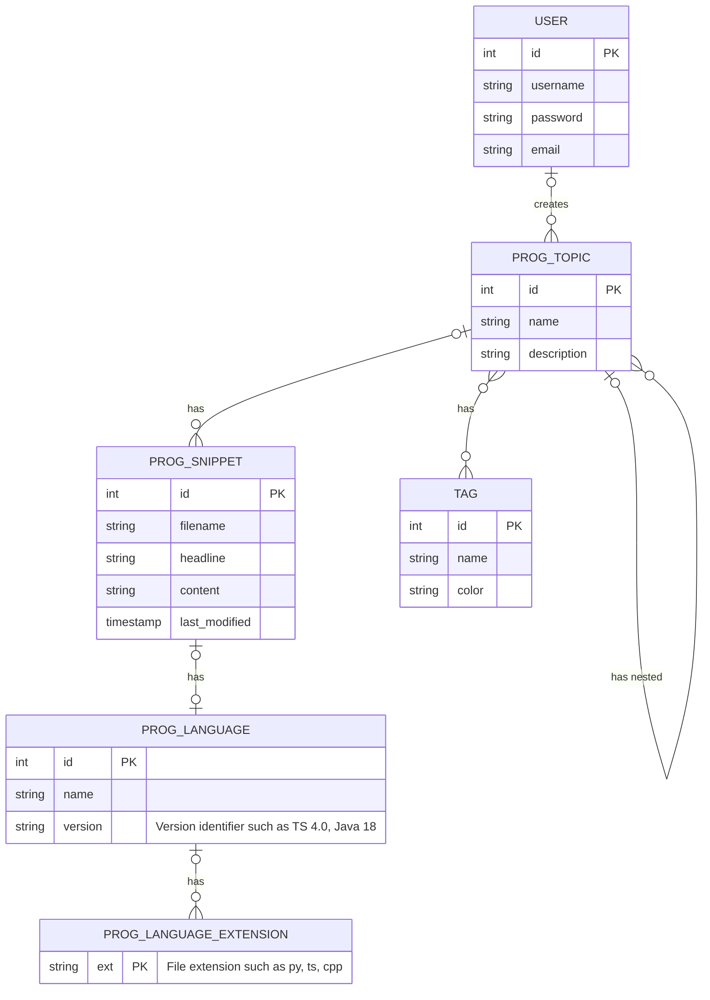

# 1.1 Conceptual Modeling

## 1.1.1 Project Outline

The project's main purpose is to implement a system which allows its users to manage code snippets, organized into topics, enriched by tags to facilitate search and filtering.

A user has a username, a password and an email address. Users have the possibility to create new programming topics as the main unit of organization for the code snippets.

A programming topic has a name and a description. Topics can have nested topics (subtopics) of an arbitrary depth level. Tags can be assigned to each topic in order to facilitate lookup for the user. A tag has a name and a color in hexadecimal representation. Subtopics inherit the tags of their parent topics automatically.

A topic can include multiple code snippets. A code snippet has a file name, a headline, the actual code content as well as the timestamp of the last modification. A snippet has a single programming language, which in turn has a name (e.g Java) and a version (e.g 11). Every programming language has a set of supported file extensions (e.g: `hpp`, `cpp` for C++). This relationship is managed automatically in the background, not by the user, however, it is needed to determine the syntax highlighting for the given snippet based on the file name.

## 1.1.2 Entity-Relationship model

### Strong entities

- `USER`: Basic app user
- `PROG_TOPIC`: Unit to group `PROG_SNIPPET`s, supporting nesting
- `TAG`: tag to be applied to `PROG_TOPIC`s to facilitate snippet lookup
- `PROG_LANGUAGE`: Programming language of snippets

### Weak entities

- `PROG_SNIPPET`: The actual code snippet which cannot exist without an enclosing `PROG_TOPIC`

### Relationships

#### Unary

- **1:n**
  - One `PROG_TOPIC` has many nested `PROG_TOPIC`s

#### Binary

- **1:1**
  - One `PROG_SNIPPET` can have one `PROG_LANGUAGE`
- **1:n**
  - One `USER` can have many `PROG_TOPIC`s
  - One `PROG_TOPIC` can have many `PROG_SNIPPET`s
  - One `PROG_LANGUAGE` can have many `PROG_LANGUAGE_EXTENSION`s
- **n:m**
  - Many `PROG_TOPIC`s can be tagged with many `TAG`s

# 1.2 Use-Case Design

## 1.2.1 User Registration

## 1.2.2 Create a new topic

## 1.2.3 Add a tag to a topic

## 1.2.4 Add a new snippet to a topic

# 1.3 Data Analytics

## 1.3.1 Favorite language

The goal of this report is to get an insight of the most used programming language of users. From a business perspective, this detail can be used to improve the quality of the service by focusing on language-specific features, or to prompt the user with job opportunities relevant to their dominant area of expertise.

### Used Entities

- `PROG_TOPIC`
- `PROG_LANGUAGE`
- `PROG_SNIPPET`

## 1.3.2 Total lines written per tag

The goal of this report is to analyze the activity related to sepcific tags (technical keywords). This piece of information can be used to create customized related snippet recommendations for users, thus improving the quality of the service. Also, it might indicate some trends of the hottest programming topics.

### Used Entities

- `PROG_TOPIC`
- `TAG`
- `PROG_SNIPPET`
